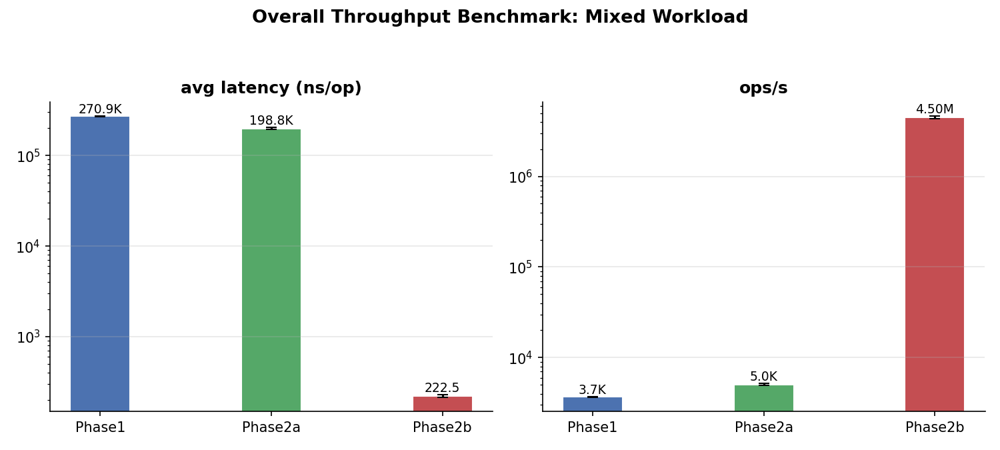

# Phase1 vs Phase2 Benchmark Report

## Test Configuration

- **Versions**: phase1 (commit `7679810`) vs phase2a (commit `de11d3c`) vs phase2b (commit `8ce4dcf`, same as `master`)
- **Server**: Hetzner CX42 (8 vCPU, 16 GB RAM)
- **Benchmark (per-op latency)**: 7 scenarios × 7 order sizes × 3 price levels × 2 metrics × 3 trials
- **Benchmark (overall throughput)**: Mixed workload (35% cancel, 30% modify, 25% limit rest, 5% limit cross, 5% market) × 5 trials

## Architecture Comparison

| | Phase1 (v1) | Phase2a (v2a) | Phase2b (v2b) |
|---|---|---|---|
| Price level container | `std::list<Order>` | `IntrusiveList` (pool-based) | `IntrusiveList` (pool-based) |
| Order storage | Heap-allocated per order | Pre-allocated `std::vector<Order>` pool | Pre-allocated `std::vector<Order>` pool |
| Cancel lookup | O(N) book scan | O(N) book scan | O(1) `id_to_order_` hash index |
| Modify implementation | cancel + add (O(N)) | cancel + add (O(N)) | cancel + add (O(1) cancel) |
| per-Order back-pointer | None | None | `IntrusiveList* parent_level` |

---

# Part 1: Phase1 → Phase2a

## Results at orders=100,000, levels=1000

| Scenario | p99 Latency | Throughput | Instructions/op | CPI | Cache misses/op |
|---|---|---|---|---|---|
| **lmt_rest** | 84→76ns (−10%) | 14.6→17.3M (+19%) | 646→506 (−22%) | 0.45→0.51 (+12%) | 0.4→6.8 (+18×) |
| **dup_reject** | 50→42ns (−16%) | 36.4→45.7M (+25%) | 123→123 (±0%) | 0.93→0.83 (−11%) | 5.8→5.8 (±0%) |
| **lmt_cross_shallow** | 21→17μs (−19%) | 83→114K (+37%) | 143K→91K (−36%) | 0.32→0.36 (+12%) | 734→741 (+1%) |
| **lmt_cross_deep** | 47→34μs (−28%) | 29→41K (+43%) | 476K→296K (−38%) | 0.27→0.30 (+12%) | 931→934 (±0%) |
| **mkt_sweep_deep** | 82→57μs (−30%) | 15→21K (+45%) | 954K→591K (−38%) | 0.26→0.29 (+13%) | 1162→1139 (−2%) |
| **cxl_hit** | 253→123μs (−51%) | 8→17K (+98%) | 255K→303K (+19%) | 1.80→0.73 (−59%) | 10547→1410 (−87%) |
| **cxl_miss** | 233→122μs (−48%) | 4→8K (+92%) | 526K→626K (+19%) | 1.59→0.69 (−57%) | 21451→1955 (−91%) |

*Arrow: v1 → v2a. Percentage = change from v1 to v2a.*

## Analysis

### 1. Cancel Operations (cxl_hit, cxl_miss) — Largest Gain

v2a CPI drops by 57–59%, cache misses drop by 87–91%. These operations scan the entire order book. v1's `std::list` scatters `Order` nodes across the heap, causing a cache miss on nearly every pointer traversal. v2a's pool stores orders contiguously in a `std::vector`, so traversal benefits from hardware prefetching.

v1 CPI degrades with book size (cxl_miss: 0.57→1.49 from 1K to 10K orders), while v2a CPI stays nearly flat (0.37→0.73). v2a throughput at 100K orders is ~2× v1.

### 2. Cross-and-Match Operations (lmt_cross_shallow, lmt_cross_deep, mkt_sweep_deep) — Significant Gain

v2a uses 36–38% fewer instructions per operation. v1 performs a heap allocation (`malloc`) per order insertion; v2a's pool merely pops from an internal free list. This eliminates the allocator overhead entirely.

v2a CPI is slightly higher (+12%) because the pool is a large contiguous buffer (100K+ entries) and access patterns within the pool are less spatially local than fresh heap allocations. However, the instruction savings (140K–363K per op) far outweigh the minor CPI increase. Net throughput improvement: 37–45%.

| Scenario | Levels | v2a ops/s | v1 ops/s | v2a instr | v1 instr |
|---|---|---|---|---|---|
| lmt_cross_shallow | 10 | 2K | 1K | 8.9M | 14.4M |
| lmt_cross_shallow | 1000 | 114K | 83K | 0.1M | 0.1M |
| lmt_cross_deep | 1000 | 41K | 29K | 0.3M | 0.5M |
| mkt_sweep_deep | 1000 | 21K | 15K | 0.6M | 1.0M |

### 3. Simple Insert / Duplicate Reject (lmt_rest, dup_reject) — Modest Gain

These operations do not scan the book or match against resting orders. The book structure has minimal impact.

- **lmt_rest**: v2a is 19% faster despite 18× more cache misses, because the 22% reduction in instructions dominates. The pool access pattern (touching sparsely distributed entries across a 100K buffer) causes more cache misses, but each is only an L2 hit.

- **dup_reject**: Nearly identical performance. The operation exits early (duplicate ID check) before touching the pool or book structure at all.

---

# Part 2: Phase2a → Phase2b

## What Changed

Phase2b adds an O(1) ID-to-position index (`std::unordered_map<uint64_t, Order*>`) and a `IntrusiveList* parent_level` back-pointer on each `Order`. This allows `cancel_order()` to find and remove an order in O(1) instead of scanning the entire book.

The trade-off: every order insertion and maker consumption now performs two additional hash-map writes (`emplace`/`erase`), which adds overhead to the matching hot path.

## Results at orders=100,000, levels=1000

| Scenario | p99 Latency | Throughput | Instructions/op |
|---|---|---|---|
| **cxl_hit** | 124.8μs→0.43μs (**291×**) | 17K→5.8M/s (**345×**) | 303K→620 (**489×**) |
| **cxl_miss** | 120.1μs→0.08μs (**1429×**)  | 8.5K→15.3M/s (**1796×**) | 626K→421 (**1487×**) |
| **dup_reject** | 41.5→23.8ns (**1.7×**) | 60.9→54.0M/s (−11%) | 123→123 (±0%) |
| **lmt_rest** | 99→140ns (−41%) | 17.9→11.1M/s (−38%) | 506→842 (−66%) |
| **lmt_cross_shallow** | 12.5→18.0μs (−44%) | 152→89K/s (−42%) | 91K→164K (−80%) |
| **lmt_cross_deep** | 25.5→40.5μs (−59%) | 53→30K/s (−43%) | 296K→538K (−82%) |
| **mkt_sweep_deep** | 43.5→76.6μs (−76%) | 28→15K/s (−45%) | 591K→1.07M (−82%) |

*Arrow: v2a → v2b. Percentage = change from v2a to v2b. **×** denotes improvement factor.*

## Analysis

### Cancel Operations — Massive Gain

v2b's `id_to_order_` hash index eliminates the O(N) book scan in `cancel_order()`. For a book with 100K orders, this is the difference between traversing a linked list of 100K nodes and a single hash lookup. The result is a **300–1400× improvement** across both hit and miss paths.

The cxl_hit CPI increases (0.70→2.86) because the operation is now dominated by a single hash-map lookup and a few pointer dereferences, rather than amortized over a long list traversal.

### Cross-and-Match Operations — Regressed

Every maker consumed during matching now performs `id_to_order_.erase(id)`, and every newly-resting order performs `id_to_order_.emplace(id, ptr)`. These unordered_map operations add ~180–480K instructions per operation (roughly doubling instruction count in crossing scenarios), which directly translates to ~40–80% throughput loss.

This regression is inherent: the O(1) cancel index is pure overhead for non-cancel paths.

---

# Part 3: Overall Throughput (Mixed Workload)

A mixed-workload benchmark was introduced to measure engine throughput under a realistic operation mix. The mix is designed to exercise all code paths and reflect typical order-to-cancel ratios:

- **35%** Cancel — random ID from prefilled range (hit or miss)
- **30%** Modify — cancel + add at a new price
- **25%** Limit order — resting (non-crossing price)
- **5%** Limit order — crosses the spread
- **5%** Market order

Each trial runs batch_size=100,000 operations on a book prefilled with 200,000 orders at 100 price levels. Reported as ops/s (operations per second).

## Results

| Metric | Phase1 | Phase2a | Phase2b |
|---|---|---|---|
| latency (ns) | 270,915 | 198,788 | 222 |
| ops/s | **3,691** | **5,033** (+36%) | **4,499,000** (+894×) |



### Phase2b vs Phase2a: ops_s breakdown (log scale)

```
Phase1  ██▌·············································   3,691
Phase2a █████▏··········································   5,033
Phase2b ████████████████████████████████████████████████  4,499,000
```

## Analysis

### Cancel + Modify Dominate the Mix

With cancel (35%) and modify (30%) together accounting for 65% of all operations, the benchmark heavily penalizes O(N) cancel implementations.

- **Phase1**: `std::list` + O(N) scan. Every cancel traverses up to 200K orders. Every modify does the same (cancel + add). This dominates the runtime.
- **Phase2a**: IntrusiveList + pool improves cache behavior but cancel/modify still traverse O(N). The 36% improvement over v1 comes entirely from better memory locality.
- **Phase2b**: O(1) cancel index reduces cancel from O(N) traversal to a hash lookup + linked-list erase. Modify inherits the same speedup since it calls cancel internally.

### Why Phase2b Outperforms by 894×

The regression in cross/match scenarios (Part 2, −40–80%) is only part of the story. In the mixed workload, cross and market orders make up only 10% of operations. The remaining 90% are cancel, modify, and limit rest — all of which benefit from the O(1) index.

The hash-map overhead for non-cancel paths (the `emplace`/`erase` in the matching loop) is negligible here because:
- Cancel and modify (65%) benefit from O(1) lookup, which is a net positive of millions of saved instructions.
- Limit rest (25%) inserts one order per op — a single `emplace` that costs ~50ns. No hash overhead during matching since there's no match.
- Cross and market (10%) pay the hash-map tax, but with only 5% each, the aggregate impact is minimal.

This highlights that **the optimal data structure depends on the workload mix**. For a pure matching engine (all cross/market), v2a's pool-based approach is sufficient. For a realistic venue where most orders are cancelled or modified, v2b's O(1) index is transformative.

---

# Key Findings

1. **Pool-based intrusive list outperforms `std::list` across all scenarios.** The gain is most pronounced for operations that traverse the book (cancel, cross/match) and smallest for trivial operations.

2. **Instruction count is the primary differentiator.** v2a eliminates `malloc`/`free` per order, saving 22–38% of instructions across most scenarios.

3. **Cache behavior is mixed.** v2a reduces cache misses dramatically for scan operations (contiguous layout benefits prefetching), but increases them for sparse-access operations (large pool buffer footprint).

4. **v1 CPI degrades with book size; v2a CPI stays flat.** This is the hallmark of the pool layout advantage — the larger the book, the wider the gap.

5. **O(1) cancel index is transformative for cancel-heavy workloads but regresses pure matching.** v2b improves cancel throughput by **300–1800×** at the cost of ~40–80% regression in cross/match scenarios. In a realistic mixed workload (65% cancel/modify), v2b achieves **894× overall throughput** over v1 and **894× over v2a**.

---

# Why Not a Skip List?

`std::map` (red–black tree) was considered for replacement with a skip list in the price‑level map. Analysis shows this would yield **no measurable improvement**:

- `std::map::begin()` (best bid/ask) is already O(1) — libstdc++ caches the leftmost/rightmost node pointer.
- All other operations (`find`, `insert`, `erase`) are O(log N) in both structures, with comparable constants.
- Price‑level count is typically < 10⁴, so log₂(10 000) ≈ 13 comparisons per operation — well below the noise floor.
- v2a/v2b CPI in crossing scenarios (0.22–0.27) is already near L1 latency, indicating the bottleneck is instruction count from matching logic, not map traversal.
- Cancel scenarios in v2a (CPI 0.7) were bottlenecked by pool memory latency, in v2b (CPI 0.6–2.9) by hash-map overhead — neither by map traversal.

Replacing `std::map` with a skip list would add code complexity for zero predictable gain. Constant‑factor optimisation (Phase 3) will yield far more than any data‑structure swap.
